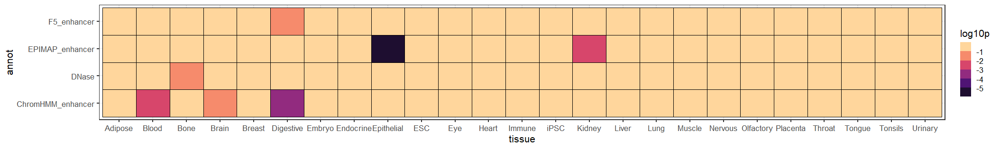

# BTS
An R package implementing a Bayesian model for joint prioritization of variants and tissues in Genome Wide Association Studies (GWAS).

## Installation
If necessary, first install devtools (for package management), Rcpp and RcppArmadillo (for an interface between R and C++). 
Then devtools can install BTS directly from this repository.

```
install.packages("devtools")
install.packages("Rcpp")
install.packages("RcppArmadillo")
devtools::install_github("matei-ionita/BTS")
```

## Summary
GWAS typically publish summary statistics describing the association of multiple genomic variants with a trait of interest.
But these ignore the correlation between variants (linkage disequilibrium) and the tissue or cell type context. We aim to 
jointly prioritize tissues and variants likely to be causal, using tissue- or cell type-specific functional annotations.
BTS is a highly optimized algorithm for fitting and comparing hundreds of such models in a short amount of time.



## Usage
To be continued...
